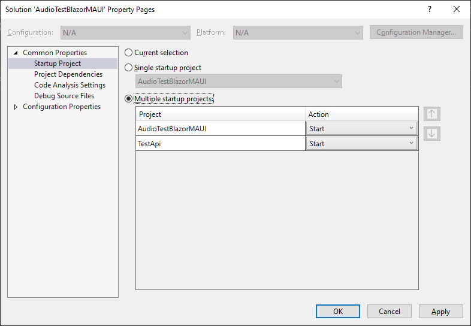

# Playing Audio in MAUI Apps

## Introduction

In this episode, I'll show you how you can play audio in your MAUI apps without dropping down to platform-specific code. I'll also show you a pattern for downloading files to the local cache directory, which is application specific, and loading those files from the cache, even when offline. Finally, we will give the user feedback as to the position of the audio, and the ability to play, pause, and stop the audio. As well, we'll provide buttons for jumping back or ahead 10 seconds. 10 is an arbitrary number that can be easily changed.

First of all, I need to give props to **Gerald Versluis**, a software engineer at Microsoft who came out with an excellent YouTube video on September 5, 2022: [Play Sound in .NET MAUI with Plugin.Maui.Audio](https://www.youtube.com/watch?v=oIYnEuZ9oew). In this video he embeds a WAV file as a resource (also not platform-specific) and shows how you can play it on demand using a plugin that he and Microsoft MVP **Shaun Lawrence** published: [Plugin.Maui.Audio](https://libraries.io/github/bijington). 

Gerald shows the basic mechanics of playing audio with Plugin.Maui.Audio, but I wanted to use it for the purposes outlined in the first paragraph. It was extremely easy to figure out, as I'm used to using this kind of tool for playing audio from a developer's perspective. 

We're going to write this as a `MAUI Blazor` app. This has become my preferred template for writing MAUI apps. I'm also deep into Blazor at the moment [for obvious reasons](https://blazortrain.com). 

Let's get to it!

## Prerequisites

The following prerequisites are needed for this demo.

### .NET 6.0

Download the latest version of the .NET 6.0 SDK [here](https://dotnet.microsoft.com/en-us/download).

### Visual Studio 2022

For this demo, we are going to use the latest version of [Visual Studio 2022](https://visualstudio.microsoft.com/vs/community/).

### Required Workloads

In order to build ASP.NET Core Web API applications, the **ASP.NET and web development** workload needs to be installed. In order to build **.NET MAUI** applications, you also need the **.NET Multi-platform App UI development** workload, so if you do not have them installed let's do that now.

  

### Create a MAUI Blazor app called AudioTestBlazorMAUI


### Fix the Window Size and Position

When you run a MAUI app on the Windows platform, you don't get control over the size and position of the Window. If you have a huge monitor like me, that means your app will take up most of the screen, and you'll have to resize and move it every time you run it.

A solution (for now) is to use some platform-specific code. It's not perfect, as you'll see, but it's something. If you know of a better way to achieve this, please email me at carl@appvnext.com.

#### Globals

Add the following file to your project:

*Globals.cs*:

```c#
#if WINDOWS
using Microsoft.UI;
using Microsoft.UI.Windowing;
using Windows.Graphics;
#endif

namespace AudioTestBlazorMAUI
{
    public static class Globals
    {
        public static readonly int WindowWidth = 900;
        public static readonly int WindowHeight = 500;
#if WINDOWS
        public static Microsoft.UI.Windowing.AppWindow AppWindow {get;set;}
#endif
    }
}
```

This static class is where we can place the desired width and height of the window. It also holds a reference to the AppWindow created in *App.cs*, which we will address next. Note that the `#if WINDOWS`statements inject platform-specific code including using statements. Those will only show up if we're running on the Windows platform.

Next, replace *App.cs* with this code:

*App.cs*:

```c#
#if WINDOWS
using Microsoft.UI;
using Microsoft.UI.Windowing;
using Windows.Graphics;
#endif

namespace AudioTestBlazorMAUI;

public partial class App : Application
{
    public App()
    {
        InitializeComponent();

        Microsoft.Maui.Handlers.WindowHandler.Mapper.AppendToMapping(nameof(IWindow), (handler, view) =>
        {
#if WINDOWS
            var mauiWindow = handler.VirtualView;
            var nativeWindow = handler.PlatformView;
            nativeWindow.Activate();
            IntPtr windowHandle = WinRT.Interop.WindowNative.GetWindowHandle(nativeWindow);
            WindowId windowId = Microsoft.UI.Win32Interop.GetWindowIdFromWindow(windowHandle);
            Globals.AppWindow = Microsoft.UI.Windowing.AppWindow.GetFromWindowId(windowId);
            Globals.AppWindow.Resize(new SizeInt32(Globals.WindowWidth, Globals.WindowHeight));
            //Globals.AppWindow.Hide(); // doesn't work here
#endif
        });

        MainPage = new MainPage();
    }
}
```

Once we create the `AppWindow`, we store the reference in the `Globals` object, and then call the `Resize` method.

But we still have a problem: we need to move the window where we want it.  In this case, I want the window in the center of the screen. Even though I can call `Globals.AppWindow.Move` here, I don't know (nor can I get) the width and height of the display, which I need in order to calculate where to put the window.

My first thought was to hide the window, or make it invisible, and then once I know the screen dimensions (MainPage_Loaded) I can move it to the right place, and then show the window.

Note this commented line:

```c#
//Globals.AppWindow.Hide(); // doesn't work here
```

That says it all. Hiding the window here in `App.cs` doesn't work. So, we have to put up with the correctly-sized window showing up in the left-most corner, and then magically moving to the center of the screen.

The next step is to replace the code in *MainPage.xaml.cs* so we can move the window:

*MainPage.xaml.cs*:

```c#
#if WINDOWS
using Microsoft.UI;
using Microsoft.UI.Windowing;
using Windows.Graphics;
#endif

namespace AudioTestBlazorMAUI;

public partial class MainPage : ContentPage
{
    public MainPage()
    {
        InitializeComponent();
        this.Loaded += MainPage_Loaded;
    }

    private void MainPage_Loaded(object sender, EventArgs e)
    {
#if WINDOWS
        var width = DeviceDisplay.Current.MainDisplayInfo.Width;
        var height = DeviceDisplay.Current.MainDisplayInfo.Height;
        var X = Convert.ToInt32((width / 2) - ((double)Globals.WindowWidth / 2));
        var Y = Convert.ToInt32((height / 2) - ((double)Globals.WindowHeight / 2));
        var point = new PointInt32();
        point.X = X;
        point.Y = Y;
        Globals.AppWindow.Move(point);
        //Globals.AppWindow.Show(); // already shown.
#endif
    }
}
```

This code should be easy to parse. I'm handling the `Loaded` event, calculating the position from `DeviceDisplay.Current.MainDisplayInfo`'s `Width` and `Height` properties, and then calling `Globals.AppWindow.Move` to move the window to it's proper location.

When you run the app, it will appear briefly in the upper-left, and then move to the center of your screen:


### Remove Unnecessary Code

Next, we're going to remove the following files from the project:

- *Pages\FetchData.razor*
- *Pages\Counter.razor*
- *Data* folder
- *Shared\NavMenu.razor*
- *Shared\SurveyPrompt.razor*

Remove the following lines from *MauiProgram.cs*:

```c#
using AudioTestBlazorMaui.Data;
```

and

```c#
builder.Services.AddSingleton<WeatherForecastService>();
```

Change *Shared\MainLayout.razor* to the following:

```c#
@inherits LayoutComponentBase

<div class="page">
	<main>
		<article class="content px-4">
			@Body
		</article>
	</main>
</div>
```

And in *Pages\Index.razor* remove the `<SurveyPrompt>` definition:

```c#
@page "/"
    
<h1>Hello, World!</h1>

Welcome to your new app.
```

Run the app now, and it should look like this:


#### Add the Plugin.Maui.Audio package

You can do this by using the package manager, but be aware that as of this recording, it's in **preview**. 

I added this to my *AudioTestBlazorMAUI.csproj* file:

```xml
<ItemGroup>
    <PackageReference Include="Plugin.Maui.Audio" Version="0.1.0-preview1" />
</ItemGroup>
```

Add the following to the top of *MauiProgram.cs*:

```c#
global using Plugin.Maui.Audio;
```

And add this line just above `return builder.build();`

```c#
builder.Services.AddSingleton(AudioManager.Current);
```

This will allow us to inject a `IAudioManager` instance wherever we need it. 

##### IAudioPlayer

From the `IAudioManager` instance we can create an `IAudioPlayer` instance to play audio and do everything else that comes with an audio player. These instances operate independently of each other, and will even play in the background. For example, you can have one instance playing the soundtrack for a game, which will be a lower volume. Then you could use another player instance for each sound effect you want to play, and trigger them at will.

In our application, we only want one player active at a time.

Next, we're going to add the following statement to *_Imports.razor*:

```c#
@using Plugin.Maui.Audio
```

### MediaState

Next we need a class that represents the state of the media being played. `IAudioPlayer` exposes an *IsPlaying* bool property, but it doesn't tell you if your app is paused. 

So, let's add the following enumeration class to the project:

*MediaState.cs*:

```c#
namespace AudioTestBlazorMAUI
{
    public enum MediaState
    {
        Stopped,
        Paused,
        Playing
    }
}
```

This will let us keep track of exactly what's going on with the player.

### Main Code

Now we're ready to write the code.

Add a code-behind file for *Index.razor* to the *Pages* folder. We'll come back to this in a minute.

*Index.razor.cs*:

```c#
using Microsoft.AspNetCore.Components;

namespace AudioTestBlazorMAUI.Pages
{
    public partial class Index : ComponentBase
    {
        [Inject] private IAudioManager _audioManager { get; set; }

        protected IAudioPlayer player = null;       // media player
        protected FileStream stream = null;         // stream used for playing
        private MediaState mediaState;              // Stopped, Paused, or Playing
        protected string url = "https://media.pwop.com/files/music/carl/03_ChainReaction_CarlFranklin_BeenAWhile.mp3";
        protected string AudioMessage = "";         // Playing, Paused or error
        protected double Percentage = 0;            // percentage of audio played used to set progress bar value
        protected string ProgressPercent = "";      // formatted percentage string (not shown in this demo)
        protected string PlayPosition = "";         // calculated from current position
        protected string ControlsOpacity = ".5";    // .5 for 'disabled' 
        protected string PlayOpacity = "1";         // 1 for 'enabled'
        protected string playButtonClass = "imageButton";   // image reacts when pressed
        protected string pauseButtonClass = "";     // see SetState to see these classes in action
        protected string stopButtonClass = "";
        protected string rewindButtonClass = "";
        protected string forwardButtonClass = "";
        private System.Timers.Timer timer = null;   // Used to report current position

        /// <summary>
        /// Change UI depending on the state
        /// </summary>
        /// <param name="state"></param>
        private void SetState(MediaState state)
        {
            mediaState = state;
            if (state == MediaState.Playing)
            {
                ControlsOpacity = "1";
                PlayOpacity = ".5";
                AudioMessage = "Playing";
                playButtonClass = "";
                pauseButtonClass = "imageButton";
                stopButtonClass = "imageButton";
                rewindButtonClass = "imageButton";
                forwardButtonClass = "imageButton";
            }
            else if (state == MediaState.Paused || state == MediaState.Stopped)
            {
                ControlsOpacity = ".5";
                PlayOpacity = "1";
                playButtonClass = "imageButton";
                pauseButtonClass = "";
                stopButtonClass = "";
                rewindButtonClass = "";
                forwardButtonClass = "";
                if (state == MediaState.Stopped)
                {
                    Percentage = 0;
                    AudioMessage = "";
                    PlayPosition = "";
                }
                else
                {
                    AudioMessage = "Paused";
                }
            }
        }

        /// <summary>
        /// Called from the Play button
        /// </summary>
        /// <returns></returns>
        protected async Task PlayAudio()
        {
            // ignore if we're already playing
            if (mediaState == MediaState.Playing) return;

            // are we paused?
            if (mediaState == MediaState.Paused && player != null)
            {
                // yes. Continue playing
                player.Play();
                SetState(MediaState.Playing);
                return;
            }

            // exit if there is no url specified
            if (string.IsNullOrEmpty(url))
            {
                AudioMessage = "Please enter a URL to an MP3 file";
                return;
            }

            // here we go!
            try
            {
                // This is where we are storing local audio files
                string cacheDir = FileSystem.Current.CacheDirectory;


                // get the fully qualified path to the local file
                var localFile = $"{cacheDir}\\{Path.GetFileName(url)}";

                // download if need be
                if (!File.Exists(localFile))
                {
                    // let the user know we're trying to download
                    AudioMessage = "Downloading...";
                    await InvokeAsync(StateHasChanged);

                    // this code downloads the file from the URL
                    using (var client = new HttpClient())
                    {
                        var uri = new Uri(url);
                        var response = await client.GetAsync(url);
                        response.EnsureSuccessStatusCode();
                        using (var stream = await response.Content.ReadAsStreamAsync())
                        {
                            var fileInfo = new FileInfo(localFile);
                            using (var fileStream = fileInfo.OpenWrite())
                            {
                                await stream.CopyToAsync(fileStream);
                            }
                        }
                    }
                }

                // File exists now. Read it
                stream = File.OpenRead(localFile);

                // create the audio player
                player = _audioManager.CreatePlayer(stream);

                // handle the PlaybackEnded event
                player.PlaybackEnded += Player_PlaybackEnded;

                // create a timer to report progress
                timer = new System.Timers.Timer(50);

                // handle the Elapsed event
                timer.Elapsed += async (state, args) =>
                {
                    // calculate the percentage complete
                    Percentage = (player.CurrentPosition * 100) / player.Duration;

                    // Not used, but if you want to show the percent completed...
                    ProgressPercent = Percentage.ToString("N2") + "%";

                    // calculate the PlayPosition string to report "current time / total time"
                    var tsCurrent = TimeSpan.FromSeconds(player.CurrentPosition);
                    var tsTotal = TimeSpan.FromSeconds(player.Duration);
                    var durationString = $"{tsTotal.Minutes.ToString("D2")}:{tsTotal.Seconds.ToString("D2")}";
                    var currentString = $"{tsCurrent.Minutes.ToString("D2")}:{tsCurrent.Seconds.ToString("D2")}";
                    PlayPosition = $"{currentString} / {durationString}";

                    // update the UI
                    await InvokeAsync(StateHasChanged);
                };

                // start the timer
                timer.Start();
                // start playing
                player.Play();
                // configure the UI for playing
                SetState(MediaState.Playing);
                // update the UI
                await InvokeAsync(StateHasChanged);

            }
            catch (Exception e)
            {
                AudioMessage = "Please enter a valid URL to an MP3 file";
            }
        }

        /// <summary>
        /// Skip forward 10 seconds
        /// </summary>
        protected void Forward()
        {
            if (mediaState == MediaState.Playing)
            {
                var pos = player.CurrentPosition + 10;
                if (pos < player.Duration)
                    player.Seek(pos);
                else
                    StopAudio();
            }
        }

        /// <summary>
        /// Stop
        /// </summary>
        protected void StopAudio()
        {
            if (mediaState == MediaState.Playing)
            {
                player.Stop();
                SetState(MediaState.Stopped);
            }
        }

        /// <summary>
        /// Pause
        /// </summary>
        protected void PauseAudio()
        {
            if (mediaState == MediaState.Playing)
            {
                player.Pause();
                SetState(MediaState.Paused);
            }
        }

        /// <summary>
        /// Rewind 10 seconds (or to the beginning)
        /// </summary>
        protected void Rewind()
        {
            if (mediaState == MediaState.Playing)
            {
                var pos = player.CurrentPosition - 10;
                if (pos < 0)
                    pos = 0;
                player.Seek(pos);
            }
        }

        /// <summary>
        /// Tear down everything when playback ends
        /// </summary>
        /// <param name="sender"></param>
        /// <param name="e"></param>
        protected async void Player_PlaybackEnded(object sender, EventArgs e)
        {
            // Update the UI
            SetState(MediaState.Stopped);
            // dispose the stream
            stream.Dispose();
            // stop and dispose the timer
            timer.Stop();
            timer.Dispose();
            // unhook this event
            player.PlaybackEnded -= Player_PlaybackEnded;
            // dispose the player
            player.Dispose();
            // update the ui
            await InvokeAsync(StateHasChanged);
        }
    }
}
```

Replace *Index.razor* with the following:

```c#
@page "/"

<div>Enter a URL to an MP3 file:</div>
<input style="width: 100%;" @bind="@url" />
<br />
<br />


<br />
<br />
<progress style="width: 100%; height: 50px;" max="100" value="@Percentage"></progress>
<br />
<div> @AudioMessage @PlayPosition</div>
```

Next, add a scoped CSS file for *Index.razor* to the *Pages* folder:

*Index.razor.css*

```css
.imageButton {
    transition: 0.2s all;
}

.imageButton:active {
    transform: scale(0.95);
}
```

Now add the following buttons to the *wwwroot* folder from the repo:  *ffwd.png*, *pause.png*, *play.png*, *rewind.png*, and *stop.png*


Before I get into the code, run the app to test the functionality:


You can enter a URL to any audio file. I've included a link to one of my original songs, `Chain Reaction`, on which the amazing [John Scofield](https://www.johnscofield.com/) plays guitar.

Try it out. Note that when you select a button that's disabled, nothing happens. When you select the Play button, however, because it's enabled, it gets a little bit smaller. This is done with the css class we added, `imageButton`. Experiment with the functionality.

### Markup

Let's look at *Index.razor*:

Here's the input tag, bound to a field called `url`:

```html
<input style="width: 100%;" @bind="@url" />
```

Next, let's look at the first button definition (rewind):

```html

```

Note that the class is bound to a string variable. That's so we can change the class dynamically *with no JavaScript!*. 

I do the same with opacity. I have one opacity string for the disabled controls (`controlsOpacity`) and one for the enabled controls (`playOpacity`). It would probably be more accurate to call them `disabledOpaceity` and `@enabledOpacity` and I probably will make that change at some point.

The rest of the controls follow this same pattern. Here I've made them all fit on the page without wrapping:

```html


```

Next, I show a progress bar to visually report the current position within the audio as it's playing:

```html
<progress style="width: 100%; height: 50px;" max="100" value="@Percentage"></progress>
```

This is based on a percentage, which I will calculate and report with the `@percentage` string variable.

Finally, I'm showing two messages. 

```html
<div> @AudioMessage @PlayPosition</div>
```

`@AudioMessage` can be 'Playing', 'Paused', or an error message.

`@PlayPosition` is generated on the fly to show the current position out of the total duration.

### Code

The code in *Index.razor.cs* is commented well and should be easy to understand. 

At the top, we're injecting an `IAudioManager` to give us access to the audio plugin:

```c#
[Inject] private IAudioManager _audioManager { get; set; }
```

The module-level (or class-level) variables are well commented. Check them out now:

```c#
protected IAudioPlayer player = null;       // media player
protected FileStream stream = null;         // stream used for playing
private MediaState mediaState;              // Stopped, Paused, or Playing
protected string url = "https://media.pwop.com/files/music/carl/03_ChainReaction_CarlFranklin_BeenAWhile.mp3";
protected string AudioMessage = "";         // Playing, Paused or error
protected double Percentage = 0;            // percentage of audio played
protected string ProgressPercent = "";      // formatted percentage string 
protected string PlayPosition = "";         // calculated from current position
protected string ControlsOpacity = ".5";    // .5 for 'disabled' 
protected string PlayOpacity = "1";         // 1 for 'enabled'
protected string playButtonClass = "imageButton";   // image reacts when pressed
protected string pauseButtonClass = "";     // see SetState
protected string stopButtonClass = "";
protected string rewindButtonClass = "";
protected string forwardButtonClass = "";
private System.Timers.Timer timer = null;   // Used to report current position
```

The next thing to look at is the `SetState` method, which we can call to change the UI depending on what's happening with the audio:

```c#
private void SetState(MediaState state)
{
    mediaState = state;
    if (state == MediaState.Playing)
    {
        ControlsOpacity = "1";
        PlayOpacity = ".5";
        AudioMessage = "Playing";
        playButtonClass = "";
        pauseButtonClass = "imageButton";
        stopButtonClass = "imageButton";
        rewindButtonClass = "imageButton";
        forwardButtonClass = "imageButton";
    }
    else if (state == MediaState.Paused || state == MediaState.Stopped)
    {
        ControlsOpacity = ".5";
        PlayOpacity = "1";
        playButtonClass = "imageButton";
        pauseButtonClass = "";
        stopButtonClass = "";
        rewindButtonClass = "";
        forwardButtonClass = "";
        if (state == MediaState.Stopped)
        {
            Percentage = 0;
            AudioMessage = "";
            PlayPosition = "";
        }
        else
        {
            AudioMessage = "Paused";
        }
    }
}
```

##### PlayAudio

The meat of this code is the `PlayAudio` method, called by clicking the `Play` button. Let's go through it.

First of all, if we're already playing, bail:

```c#
// ignore if we're already playing
if (mediaState == MediaState.Playing) return;
```

Then, we check to see if we're currently paused, and if so, just play and bail:

```c#
// are we paused?
if (mediaState == MediaState.Paused && player != null)
{
    // yes. Continue playing
    player.Play();
    SetState(MediaState.Playing);
    return;
}
```

Next, we make sure the url is not empty:

```c#
// exit if there is no url specified
if (string.IsNullOrEmpty(url))
{
    AudioMessage = "Please enter a URL to an MP3 file";
    return;
}
```

The next bit of code is nested inside of a `try/catch` block.

First, we get the MAUI Cache folder location:

```c#
// This is where we are storing local audio files
string cacheDir = FileSystem.Current.CacheDirectory;
```

For more information on MAUI file system helpers, see the [Microsoft MAUI Documentation](https://docs.microsoft.com/en-us/dotnet/maui/platform-integration/storage/file-system-helpers?tabs=windows).

Next, we generate the fully qualified path to the cached version of the file specified by the url:

```c#
// get the fully qualified path to the local file
var localFile = $"{cacheDir}\\{Path.GetFileName(url)}";
```

If the file is **NOT** in our local cache, we need to download it. I'm using this code:

```c#
// download if need be
if (!File.Exists(localFile))
{
    // let the user know we're trying to download
    AudioMessage = "Downloading...";
    await InvokeAsync(StateHasChanged);

    // this code downloads the file from the URL
    using (var client = new HttpClient())
    {
        var uri = new Uri(url);
        var response = await client.GetAsync(url);
        response.EnsureSuccessStatusCode();
        using (var stream = await response.Content.ReadAsStreamAsync())
        {
            var fileInfo = new FileInfo(localFile);
            using (var fileStream = fileInfo.OpenWrite())
            {
                await stream.CopyToAsync(fileStream);
            }
        }
    }
}
```

Since this code is inside a `try/catch` block, we can be sure that the file exists at the next line of code:

```c#
// File exists now. Read it
stream = File.OpenRead(localFile);

// create the audio player
player = _audioManager.CreatePlayer(stream);

// handle the PlaybackEnded event
player.PlaybackEnded += Player_PlaybackEnded;

// create a timer to report progress
timer = new System.Timers.Timer(50);
```

This code opens the file, creates the player, wires up the `PlaybackEnded` event, and creates a new timer that will fire its `Elapsed` event every 50 milliseconds.

> Note that `stream` and `player` are both class-level variables, so they will need to be disposed when playing is done.

Next, we set up the in-line event handler for the Timer's `Elapsed` event:

```c#
// handle the Elapsed event
timer.Elapsed += async (state, args) =>
{
    // calculate the percentage complete
    Percentage = (player.CurrentPosition * 100) / player.Duration;

    // Not used, but if you want to show the percent completed...
    ProgressPercent = Percentage.ToString("N2") + "%";

    // calculate the PlayPosition string to report "current time / total time"
    var tsCurrent = TimeSpan.FromSeconds(player.CurrentPosition);
    var tsTotal = TimeSpan.FromSeconds(player.Duration);
    var durationString = $"{tsTotal.Minutes.ToString("D2")}:{tsTotal.Seconds.ToString("D2")}";
    var currentString = $"{tsCurrent.Minutes.ToString("D2")}:{tsCurrent.Seconds.ToString("D2")}";
    PlayPosition = $"{currentString} / {durationString}";

    // update the UI
    await InvokeAsync(StateHasChanged);
};
```

This changes the `Percentage` value which is bound to the progress bar's `value` attribute, and generates the `PlayPosition` string, which is shown in the UI.

The last bit in this `try/catch` block starts the timer, plays the audio, and sets up the UI state for playing:

```c#
// start the timer
timer.Start();
// start playing
player.Play();
// configure the UI for playing
SetState(MediaState.Playing);
// update the UI
await InvokeAsync(StateHasChanged);
```

If anything goes wrong we report a message to the user:

```c#
catch (Exception e)
{
    AudioMessage = "Please enter a valid URL to an MP3 file";
}
```

##### PlaybackEnded

The PlaybackEnded event happens when either we tell the player to stop, or the end of the audio is reached. It does **NOT** happen after pausing.

```c#
protected async void Player_PlaybackEnded(object sender, EventArgs e)
{
    // Update the UI
    SetState(MediaState.Stopped);
    // dispose the stream
    stream.Dispose();
    // stop and dispose the timer
    timer.Stop();
    timer.Dispose();
    // unhook this event
    player.PlaybackEnded -= Player_PlaybackEnded;
    // dispose the player
    player.Dispose();
    // update the ui
    await InvokeAsync(StateHasChanged);
}
```

Here we are resetting the UI and disposing our class-level objects. We are also unhooking the event handler itself.

The rest of the methods handle the various button actions.

##### Forward

```c#
protected void Forward()
{
    if (mediaState == MediaState.Playing)
    {
        var pos = player.CurrentPosition + 10;
        if (pos < player.Duration)
            player.Seek(pos);
        else
            StopAudio();
    }
}
```

The idea is to either advance (seek) 10 seconds ahead, or if we're less than 10 seconds from the end, just stop.

##### Rewind

```c#
protected void Rewind()
{
    if (mediaState == MediaState.Playing)
    {
        var pos = player.CurrentPosition - 10;
        if (pos < 0)
            pos = 0;
        player.Seek(pos);
    }
}
```

If the current position is less than 10 seconds from the beginning, we're going to seek to the beginning, otherwise we'll back up 10 seconds.

`StopAudio` and `PauseAudio` are self-explanatory

##### StopAudio

```c#
protected void StopAudio()
{
    if (mediaState == MediaState.Playing)
    {
        player.Stop();
        SetState(MediaState.Stopped);
    }
}
```

##### PauseAudio

```c#
protected void PauseAudio()
{
    if (mediaState == MediaState.Playing)
    {
        player.Pause();
        SetState(MediaState.Paused);
    }
}
```

That's it! Now let's look at this app running on the other platforms:

##### Android


##### iOS


##### Mac Catalyst


### Downloading Audio from an ASP.NET Core API endpoint

I didn't show this in the video, but I included code in the demo to access an mp3 audio file from an ASP.NET Core API endpoint.

#### Why?

Because you may want to control who has access to your mp3 files. In my case, I'm going to be building a **Music to Code By** app, and I only want paying customers to have access. 

Add a `Microsoft ASP.NET Core WebAPI` project to the solution called *TestApi*

Add an mp3 file to the project. In my case I've included another one of my originals: *WalkTheWalk.mp3*.

Add a controller called *FileController.cs*:

```c#
using Microsoft.AspNetCore.Mvc;

namespace TestApi.Controllers
{
    [ApiController]
    [Route("[controller]")]
    public class FileController: ControllerBase
    {
        /// <summary>
        /// API to serve a file. Useful for authenticated downloads
        /// </summary>
        /// <returns></returns>
        [HttpGet("{fileName}") ]
        public async Task<IActionResult> Get(string fileName)
        {
            string localFileName = $"{Environment.CurrentDirectory}\\{fileName}";
            if (System.IO.File.Exists(localFileName))
            {
                using (var stream = System.IO.File.OpenRead(localFileName))
                {
                    string mimeType = "application/octet-stream";
                    var bytes = await System.IO.File.ReadAllBytesAsync(localFileName);
                    return File(bytes, mimeType, Path.GetFileName(localFileName));
                }
            }
            else
            {
                return NotFound();
            }
        }

    }
}
```

You can test it by running both projects at once, which you can control in the Solution properties:



For the URL, enter https://localhost:[YOUR-PORT]/file/WalkTheWalk.mp3


## Summary

In this episode, I showed you how you can download files to a local cache and play them using the `Plugin.Maui.Audio` library. I implemented controls for the user for play, pause stop, skip ahead, and rewind. I also showed how to dynamically update the UI, including a progress bar. Finally, I showed that it can run on Windows, Android, iOS, and Mac.

Finally, I showed you (in this document only) how to set up an API endpoint to serve mp3 files.

For more information about .NET MAUI, check the links in the resources section below.

## Complete Code

The complete code for this demo can be found in the link below.

- <https://github.com/carlfranklin/AudioTestBlazorMAUI>

## Resources

| Resource Title                           | Url                                                          |
| ---------------------------------------- | ------------------------------------------------------------ |
| The .NET Show with Carl Franklin         | <https://www.youtube.com/playlist?list=PL8h4jt35t1wgW_PqzZ9USrHvvnk8JMQy_> |
| Download .NET                            | <https://dotnet.microsoft.com/en-us/download>                |
| .NET Multi-platform App UI documentation | <https://docs.microsoft.com/en-us/dotnet/maui/>              |